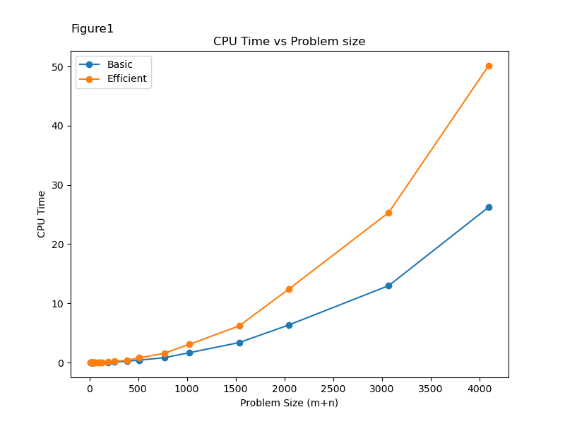
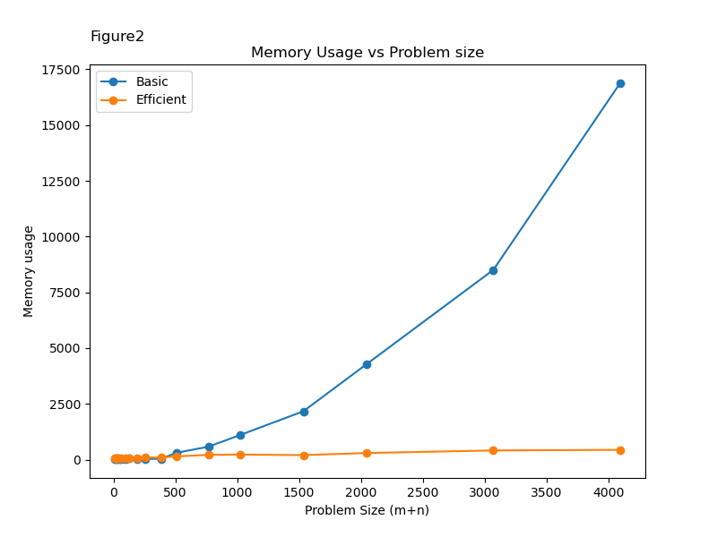

# DNA-global-Alignment
Implement a dynamic solution to solve global alignment problem between two given DNA sequences

### Contributor
Jing-Wen Chen, Kwon Cho, Brendan Liu

### Default parameters for sequence alignment
```
> Alpha table encode the penalty for mismatching between letter
alpha_table = {132: 110,         # (A,C), (C,A)
               136: 48,          # (A,G), (G,A)
               149: 94,          # (A,T), (T,A)
               138: 118,         # (C,G), (G,C)
               151: 48,          # (C,T), (T,C)
               155: 110}         # (G,T), (T,G)
               
> Delta encode the penalty for putting a gap in the sequence
delta = 30

```
### Usage
The two programs will read the 
```
python3 basic.py
python3 efficient.py
```

### CPU-time and Memory usage plot
|         CPU Time         |        Memory Usage        |
| :----------------------: | :------------------------: |
|  |  | 

### Summary
Global DNA sequence alignment is an attempt to align every base in each sequence, these alignments can lead to evolutionary,
functional, or structural relationships between the two sequences. In this final project, we implement two different algorithms in python
to achieve this global alignment. The first of which is a basic dynamic programming approach and the second of which is a divide and conquer
approach (DnC), which saves memory compared to the original dynamic programming approach.

- Brief description of data point generation: 18 data points (output files) were generated by gradually increasing 2 times of m*n length sizes.

Figure 1. “CPU Time vs Problem Size” for the Basic vs. Efficient Algorithm
Based on our Basic Algorithm, we could simply estimate that the time complexity will be O(mn) as our dynamic programming function (Compute_array)
will take m*n iterations. Also, the runtime of the Efficient Algorithm must have the same cost as the Basic Algorithm. However, the efficient algorithm
utilizes a divide and conquer step alongside the DP step. We can expect the plot of the Basic Algorithm to increase in quadratic scale,
and the Efficient Algorithm in some quadratic scale greater than the Basic algorithm. Our “CPU Time vs Problem size" plot gives us experimental data to confirm
our expectation.

Figure 2. “Memory Usage vs Problem Size” for the Basic vs. Efficient Algorithm
We can estimate that the Memory Usage of our Basic Algorithm will increase in proportion to m*n. This is because the initialization of an m*n matrix
that must be filled in; whereas, the Efficient Algorithm is only dependent on the minimum size of string size (min (m,n)). Therefore, we can expect
the plot of Basic Algorithm would increase in quadratic scale, and Efficient Algorithm in linear scale. In “Memory Usage vs Problem size plot”,
Basic graph showed quadratic scale increase, and Efficient graph showed linear scale increase. This is in line with our expectations.

For small sequences, such as the input1.txt and input2.txt that was given to us the basic and efficient approach had a runtime and
memory usage comparable to each other.

Even though global alignments have exact solutions, these algorithms have a quadratic running time and memory
consumption, which makes them unusable for alignment on real datasets. Due to the large size of genomic sequences
(the human genome is 3 giga base pairs long), estimations and performance shortcuts are necessary to perform the dynamic programming steps
more efficiently.
